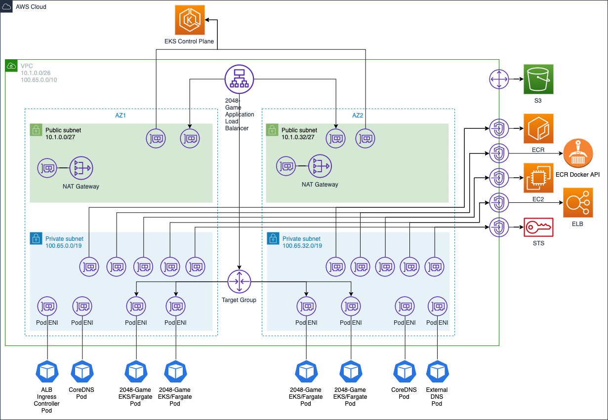

# EKS Fargate Terraform Example

## Architecture Overview

This reference architecture, implemented via Terraform, will create an EKS cluster with a Fargate-only data plane and deploy a sample application exposed via an internet-facing ALB. It will perform the following steps:

- Create a VPC and required subnets
- Create a Route53 private hosted zone
- Create an EKS Cluster
- Create VPC Endpoints required for private clusters
- Create an EKS Fargate Profile for the `kube-system` namespace for cluster-wide services such as CoreDNS, external-dns, and the ALB Ingress Controller
- Deploy the ALB Ingress Controller and External DNS in the cluster
- Create an EKS Fargate Profile for the sample application namespace
- Create and ECR repo for the sample application
- Deploy the sample 2048 application



## Prerequisites

### Tools

- Docker must be running locally to pull the demo app container and push it to ECR
- Terraform 0.12
- kubectl installed
- awscli installed

### Create the `terraform.tfvars` file with these required variables

```
# sample terraform.tfvars
region = "us-east-2"
availability_zones = ["us-east-2a", "us-east-2b" ]
vpc_cidr_block = "10.1.0.0/26"
vpc_secondary_cidr_block = "100.64.0.0/16"
name = "eks"
```

## Usage

### Run the following commands to provision the infrastructure

```
terraform init
terraform plan
terraform apply

# Setup the context for the cluster
aws eks update-kubeconfig --name eks
```

### Get URL of sample application ALB

```
export ALB_ADDRESS=$(kubectl get ingress -n 2048-game -o json | jq -r '.items[].status.loadBalancer.ingress[].hostname')

echo "http://${ALB_ADDRESS}"
```
